# 🎓 Sistema Web de Orientación Vocacional

Aplicación web full stack desarrollada para ayudar a estudiantes de educación media a identificar sus intereses profesionales mediante un test vocacional interactivo, recomendaciones impulsadas por IA y construcción de proyecto de vida.

---

## 📌 Descripción del Proyecto

La plataforma permite:

- Registro e inicio de sesión de usuarios
- Desarrollo de test vocacional de 80 preguntas
- Procesamiento automático de resultados
- Clasificación de áreas de interés
- Recomendaciones profesionales con IA (Gemini 2.5 Flash)
- Gestión de proyecto de vida
- Panel administrativo con estadísticas y exportación de datos
- Visualización gráfica de resultados

---

## 🚀 Tecnologías Utilizadas

### Frontend

- Next.js
- React
- TailwindCSS
- Recharts
- Tabler Icons

### Backend

- Django + Django REST Framework
- Simple JWT (autenticación)
- Django CORS Headers
- Openpyxl (exportación Excel)
- google-genai (Gemini 2.5 Flash)

### Base de Datos

- MySQL (Aiven)

### Despliegue

- Frontend: Vercel
- Backend: Render
- Base de datos: Aiven

---

## 🏗️ Arquitectura del Proyecto

```bash
Frontend (Next.js - Vercel)
        ↓
API REST (Django - Render)
        ↓
MySQL Database (Aiven)

        ──► Gemini 2.5 Flash API (recomendaciones IA)
```

---

## 📂 Estructura del Proyecto

```bash
project-root/
│
├── frontend/          # Aplicación Next.js
│   ├── app/           # Páginas y layout
│   ├── src/views/     # Vistas del estudiante
│   ├── src/context/   # Contextos React
│   ├── src/hooks/     # Custom hooks
│   ├── src/lib/       # Cliente API y utilidades
│   ├── src/constants/ # Constantes y tipos
│   ├── src/components/# Componentes reutilizables
│   └── public/        # Archivos estáticos (profesiones.json, imágenes)
│
├── backend/           # API REST con Django
│   ├── accounts/      # Módulo de usuarios
│   ├── assessments/   # Test vocacional, resultados y recomendaciones IA
│   │   ├── services/  # GeminiCareerService
│   │   ├── data/      # preguntas.json
│   │   └── migrations/
│   ├── core/          # Utilidades compartidas
│   ├── config/        # Configuración de Django
│   └── static/        # Diagramas de casos de uso
│
└── README.md
```

---

## ⚙️ Funcionalidades Principales

### 👤 Gestión de Usuarios

- Registro e importación masiva desde Excel
- Inicio de sesión con JWT
- Roles: estudiante y administrador

---

### 🧠 Módulo de Autoconocimiento

- 9 preguntas reflexivas
- Registro de respuestas personales
- Contenido educativo y motivacional

---

### 📝 Test Vocacional

- 80 preguntas con imágenes ilustrativas
- Dos opciones: "Me interesa" / "No me interesa"
- Navegación secuencial con avance automático
- Persistencia en base de datos por usuario
- 5 áreas vocacionales evaluadas

---

### 📊 Procesamiento de Resultados

- Cálculo automático de puntajes por área
- Identificación de área principal y secundaria
- Visualización con gráfico de pastel interactivo
- Barra de progreso por área

Áreas vocacionales:

1. Arte y Creatividad
2. Ciencias Sociales
3. Económica / Administrativa
4. Ciencia y Tecnología
5. Ciencias de la Salud

---

### 🤖 Recomendaciones con IA

- Al completar el test, el backend envía a Gemini 2.5 Flash:
  - Preguntas donde el estudiante respondió "Me interesa"
  - Área principal y secundaria detectadas
  - Profesiones candidatas filtradas por esas áreas
- Gemini devuelve máximo 10 carreras con:
  - Nombre y descripción detallada
  - Explicación personalizada de por qué se adapta al estudiante
  - Puntaje de afinidad (0-100)
- Las recomendaciones se cachean en base de datos
- Si la IA falla, se muestran las carreras del archivo `profesiones.json` como fallback

---

### 🎯 Proyecto de Vida

- Registro de visión personal
- Metas a corto, mediano y largo plazo
- Preguntas de autoevaluación académica
- Compromisos personales

---

### 🛠️ Dashboard Administrativo

- Estadísticas generales (usuarios, tests completados)
- Distribución de áreas vocacionales entre estudiantes
- Listado de usuarios con filtros
- Exportación de usuarios a Excel (.xlsx)
- Importación masiva de estudiantes desde Excel
- Visualización de respuestas de autoconocimiento y proyecto de vida por usuario
- Control de apertura/cierre de registro

---

## 🔐 Seguridad

El sistema implementa:

- Autenticación JWT
- Hash de contraseñas
- Validaciones frontend y backend
- Middleware de seguridad
- Protección CORS

---

## 📊 Modelo de Datos

Entidades principales:

- **Usuario** — estudiantes y administradores
- **Área Vocacional** — clasificación de intereses
- **Profesión** — carreras asociadas a cada área
- **Resultado** — respuestas del test y puntajes por área
- **RecomendacionIA** — carreras recomendadas por Gemini (cache)
- **ReflexionAutoconocimiento** — respuestas del módulo reflexivo
- **ProyectoVida** — metas y visión del estudiante

---

## 📂 Diagramas de Casos de Uso

Caso de uso 01 - 04: (Registrarse, Iniciar sesión, Realizar autoconocimiento, Realizar test vocacional).
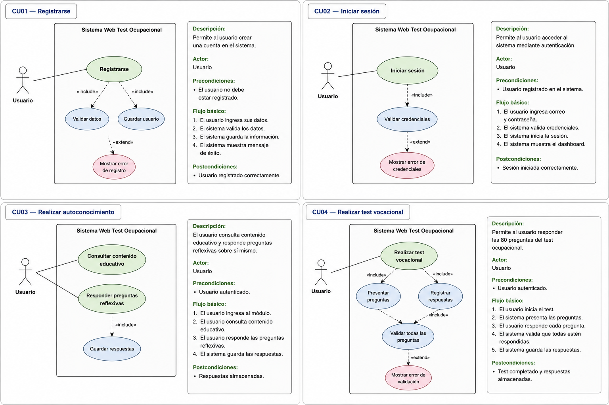

Caso de uso 05 - 08: (Visualizar resultados, Obtener recomendaciones profesionales, Gestionar proyectos de vida, Descargar resultados).
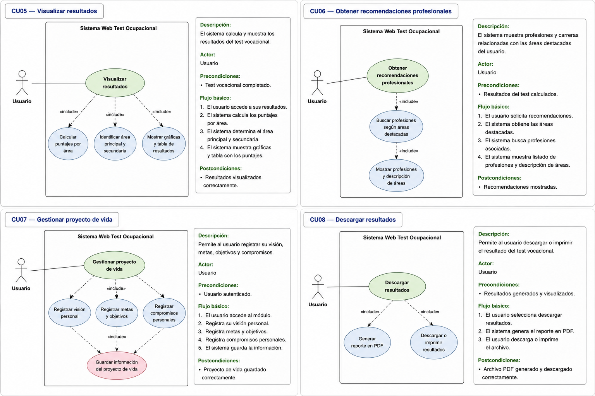

Caso de uso 09 - 12: (Consultar información educativa, Gestionar preguntas, Gestionar profesiones y áreas, Gestionar usuarios y estadísticas).
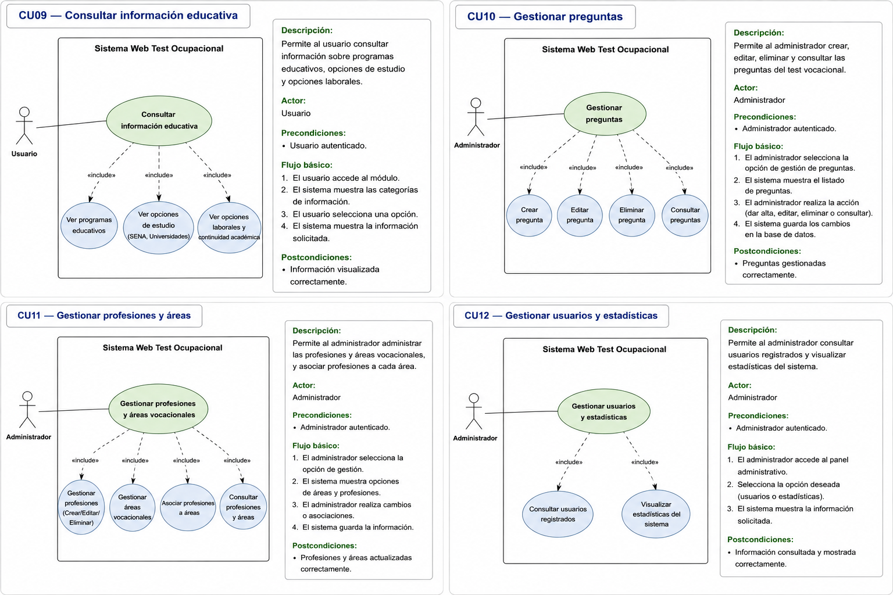

---

## 🗄️ Diseño de la DB


---

## 🎨 Mockups

### Login

**Pantalla de inicio de sesión**
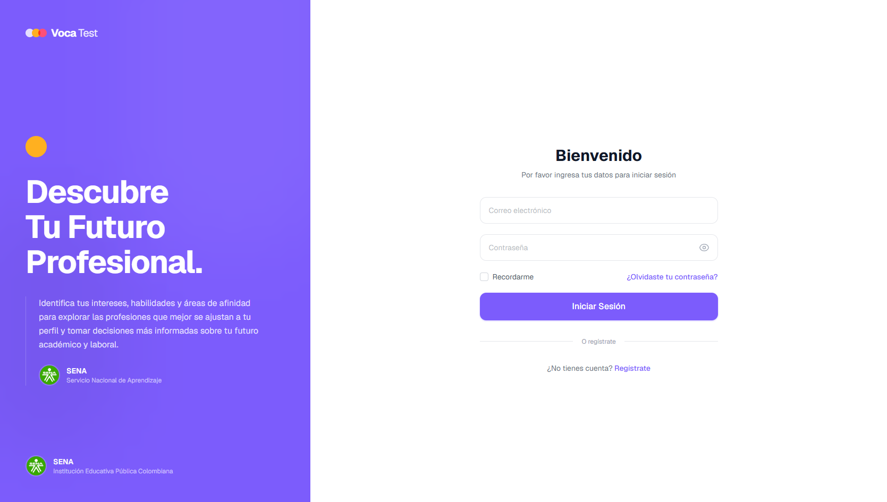

**Pantalla de registro de usuario**
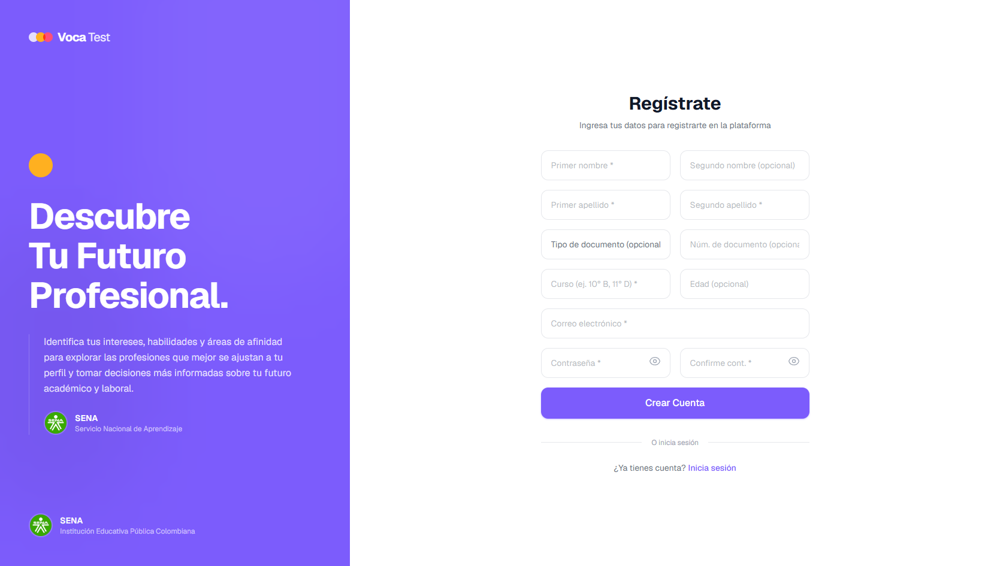

### Estudiante

**Vista de inicio del estudiante**
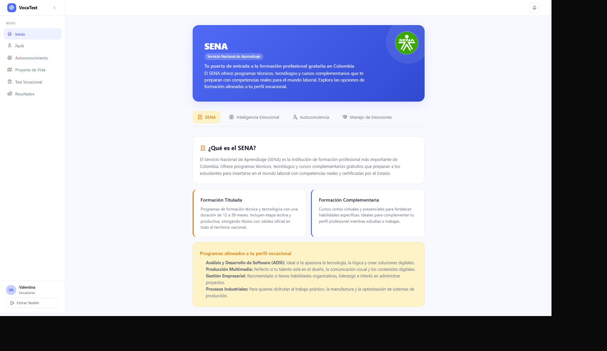
**Panel principal del estudiante**

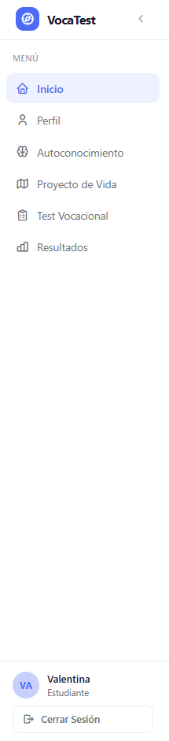

**Perfil del estudiante**
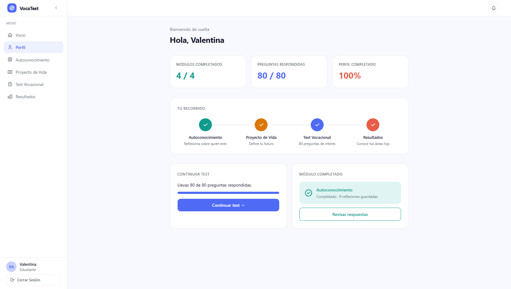

**Módulo de autoconocimiento**
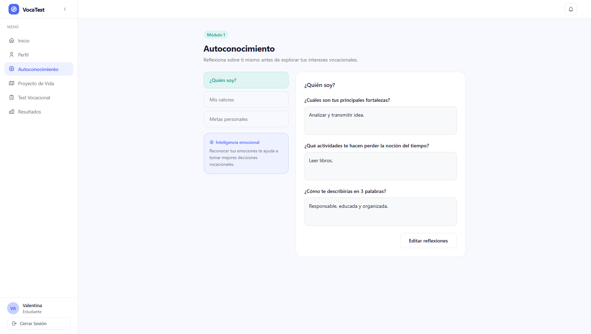

**Proyecto de vida del estudiante**


**Test vocacional**


**Resultados del test vocacional**
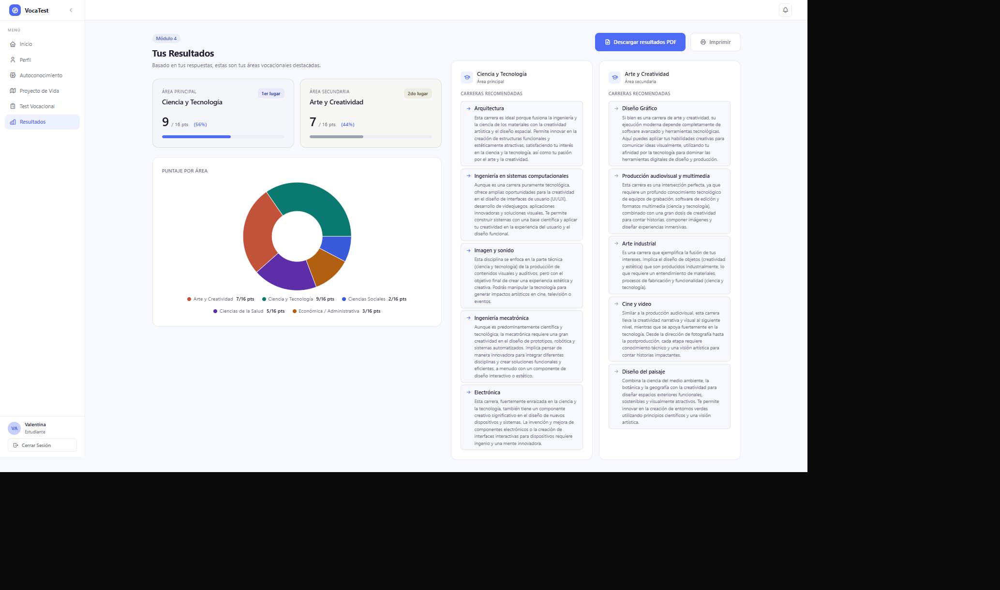

### Admin

**Vista general del panel administrativo**

**Panel de administración**

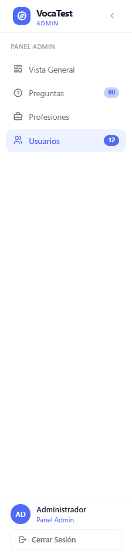

**Gestión de preguntas**
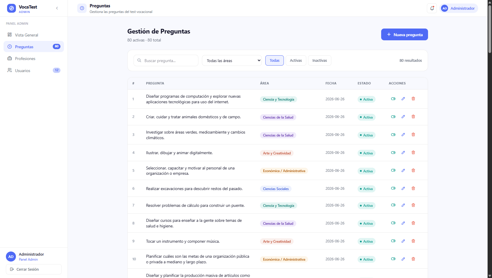

**Gestión de profesiones**
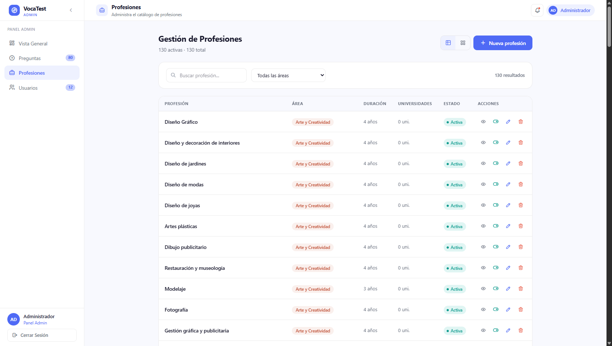

**Listado de profesiones**
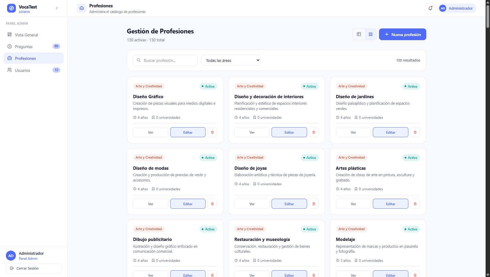

**Gestión de usuarios**
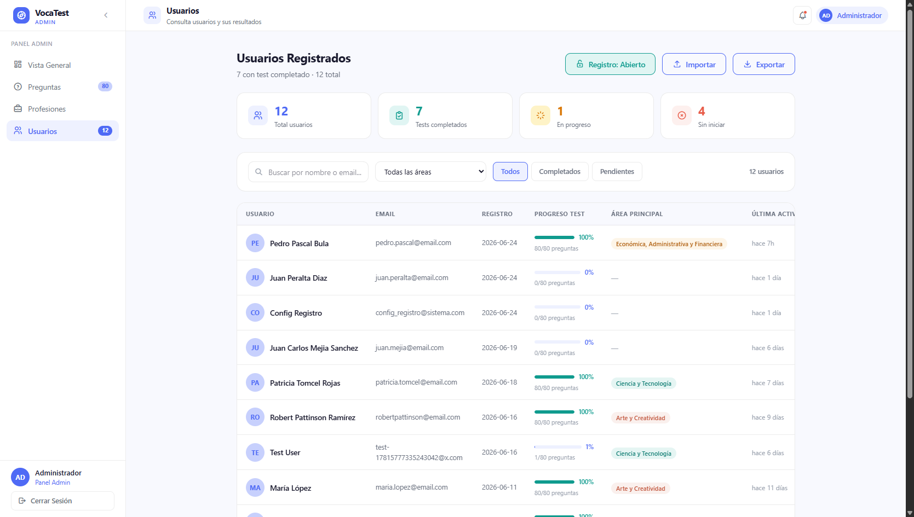

**Detalles del usuario**


---

## 👨‍💻 Autor

Proyecto desarrollado como solución académica para orientación vocacional y proyecto de vida.

---

## 📄 Licencia

Este proyecto es de uso académico y educativo.
